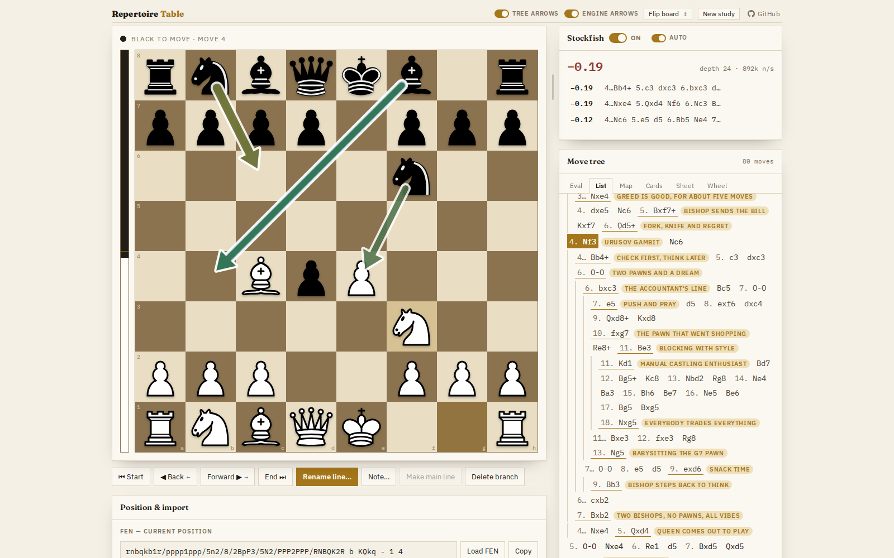
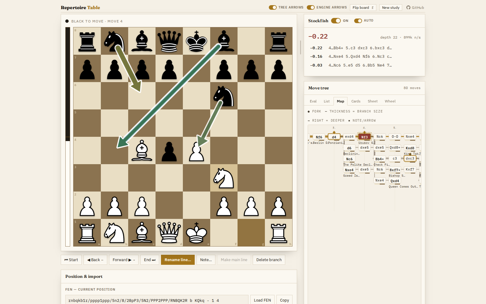
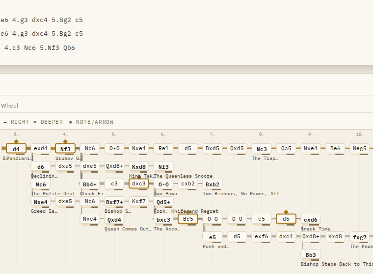
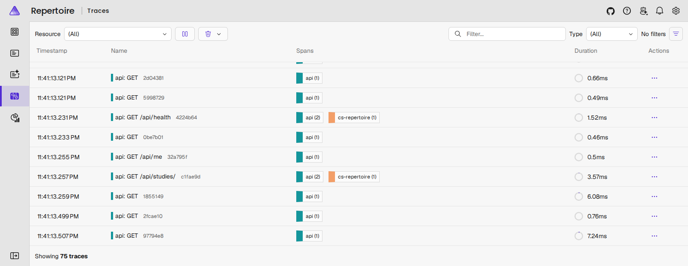

# Repertoire Table

A chess opening study board: branching move tree, your own names for every variation,
arrows/circles, FEN + PGN in and out, and Stockfish analysis.

Green arrows are the moves *you* have prepared from this position, shaded green to
red by how much they lose against Stockfish's best. Blue arrows are Stockfish's own
suggestions. Each has its own switch, and neither is tied to the suggestion list.

- `index.html` — the whole app (vanilla JS, no build step). Own chess engine, perft-verified.
- `engine/` — Stockfish 18 lite single-thread (WASM), GPLv3, see `engine/LICENSE-stockfish.txt`.
- Piece art: cburnett (from lichess), inlined as an SVG sprite.
- `src/` — the backend: ASP.NET Core + PostgreSQL, run under Aspire.

### Six ways to read the same tree

A move list is a bad shape for a repertoire, so the tree pane has six views of it.
Here is **Map** — forks branch rightward, thickness is how much theory hangs off a
branch, and your own names for the lines ride along:

The rest are Eval, List, Cards, Sheet and Wheel, in `views/`. They are plug-ins
against a small documented API — see `views/README.md` to add a seventh.

## Running

Stockfish needs a Web Worker, which browsers refuse to load from `file://`, so
the app has to come off an HTTP origin:

    cd src/Aspire/Repertoire.AppHost && aspire run

Opening `index.html` directly still works — everything except the engine.

## Sign in, or don't

There is one account. Signed in, studies save to the server and `localStorage`
keeps a local working copy, so a reload puts you back where you were. Signed
out, the app works exactly the same — you can open a study, branch it, name
lines, run the engine — but **nothing is written down**: every change lives in
memory and is gone on refresh. Cosmetic preferences (chosen view, panel sizes,
the engine toggle, the cached evaluations) are not study content and stay local
either way.

Credentials come from configuration, never the repo:

    Auth__Username=erkan Auth__Password=... aspire run

Locally `src/Api/Repertoire.Api/appsettings.Development.json` carries a
throwaway pair so the thing runs out of the box. Anywhere else the app refuses
to boot without them.

## Backend / Docker

Two backends implement the same JSON API (`docs/API.md`):

- **`src/` — ASP.NET Core + PostgreSQL. The one being built.** Serves the app
  and the API on one port, with the move tree in a `jsonb` column and cookie
  auth for the single account.
- **`legacy/python/` — FastAPI + SQLite. Retired.** No accounts: its `/api` is
  wide open, and the frontend now treats a server that cannot authenticate
  anyone as a server it cannot save to. The app still runs there, in memory.

### The .NET stack

Local development runs under [Aspire](https://aka.ms/dotnet/aspire), which
supervises the API and a PostgreSQL container together and gives you a dashboard
with traces, structured logs and metrics over OTLP:

    cd src/Aspire/Repertoire.AppHost
    aspire run

Every request is traced end to end, database spans included — the `cs-repertoire`
spans above are Postgres inside the API's own span. Logs and metrics land in the
same dashboard over OTLP.

Ports are all dynamic — take the entry points from the dashboard it prints. The
Postgres container is `ContainerLifetime.Persistent`, so your studies survive an
AppHost restart. (That relies on the `UserSecretsId` in the AppHost csproj; the
comment there explains why removing it silently eats the database.)

Or without Aspire:

    docker compose up --build                                  # http://localhost:5080

EF migrations apply on startup, so a fresh Postgres comes up ready. `dotnet-ef`
is pinned in `.config/dotnet-tools.json` — `dotnet tool restore` once, then
`dotnet ef migrations add <Name>` from `src/Api/Repertoire.Api`.

Both servers set `Cross-Origin-Opener-Policy: same-origin` and
`Cross-Origin-Embedder-Policy: require-corp` (so `SharedArrayBuffer` is
available for a future multi-threaded Stockfish), serve `.wasm` as
`application/wasm`, and disable caching so an edited `index.html` is never
stale.

### The Python stack (retired)

    python3 -m venv .venv
    .venv/bin/pip install -r legacy/python/server/requirements.txt
    legacy/python/serve.sh          # http://localhost:8000, opens a browser

`legacy/python/serve.sh` uses `.venv` if it exists, otherwise whatever `python3` is on PATH.
If `fastapi`/`uvicorn` are missing it falls back to a static-only server — the
app works, the engine works, but the `/api` endpoints do not — and says so
loudly. `PORT` and `DB_PATH` are honoured; the DB defaults to
`data/repertoire.sqlite3` (gitignored).

### Docker

    docker compose up --build      # http://localhost:8000

The SQLite file lives in the named volume `repertoire-data` mounted at
`/app/data`, so it survives `docker compose down` (use `down -v` to wipe it).
The compose service has a healthcheck on `/api/health`.

The image is ~200-250 MB: the vendored Stockfish `.wasm` alone is 7.3 MB and
the `python:3.12-slim` base plus FastAPI/uvicorn account for the rest. That's
expected, not a packaging bug.
